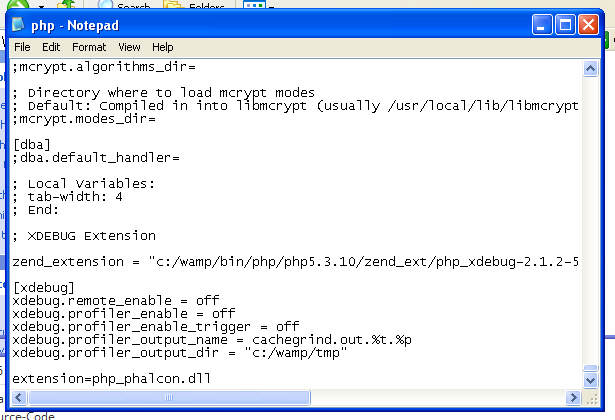

在WAMP环境中安装Phalcon
=====================
WampServer_ 是Windows平台的Web开发环境。它可以让你使用Apache2、PHP和MySQL数据库创建Web应用程序。下面我们将介绍如何在Windows平台的WampServer中安装Phalcon。推荐使用最新版本的WampServer。

WampServer_ is a Windows web development environment. It allows you to create web applications with Apache2, PHP and a MySQL database. Below are detailed instructions on how to install Phalcon on WampServer for Windows. Using the latest WampServer version is highly recommended. 

下载正确Phalcon版本
-------------------------------------
WAMP既有32位版本也有64位版本。在网站下载页中，根据你的Windows架构来选择Phalcon版本。

WAMP has both 32 and 64 bit versions. From the download section, you can choose the Phalcon for Windows accordingly to your desired architecture. 

下载Phalcon库，你将会得到一个zip文件，如下所示：

After download the Phalcon library you will have a zip file like the one shown below: 

.. figure:: ../_static/img/xampp-1.png
    :align: center

解压该文件，获取Phalcon DLL文件：    
    
Extract the library from the archive to get the Phalcon DLL: 

.. figure:: ../_static/img/xampp-2.png
    :align: center

拷贝php_phalcon.dll到PHP扩展目录下。如果你的WAMP安装在C:\\wampp目录下，PHP扩展的目录一般是C:\\wamp\\bin\\php\\php5.3.10\\ext。
    
Copy the file php_phalcon.dll to the PHP extensions. If WAMP is installed in the c:\\wamp folder, the extension needs to be in C:\\wamp\\bin\\php\\php5.3.10\\ext

.. figure:: ../_static/img/wamp-1.png
    :align: center  

编辑PHP配置文件php.ini，它位于C:\\wamp\\bin\\php\\php5.3.10\\php.ini。你可以使用记事本或类似软件编辑它。我们推荐你使用Notepad++，以避免换行可能带来的问题。在文件结尾加上这一句：extension=php_phalcon.dll，然后保存。
    
Edit the php.ini file, it is located at C:\\wamp\\bin\\php\\php5.3.10\\php.ini. It can be edited with Notepad or a similar program. We recommend Notepad++ to avoid issues with line endings. Append at the end of the file: extension=php_phalcon.dll and save it. 

同时编辑另一个php.ini文件，它位于 C:\\wamp\\bin\\apache\\Apache2.2.21\\bin\\php.ini。在文件结尾加上这一句：extension=php_phalcon.dll，然后保存。
    
Also edit another php.ini file, which is located at C:\\wamp\\bin\\apache\\Apache2.2.21\\bin\\php.ini. Append at the end of the file: extension=php_phalcon.dll and save it.

重启Apache服务器。单击系统托盘上的WampServer图标。在弹出的菜单中选择“重启所有服务”。待图标再次变绿就表示服务重启成功。

Restart the Apache Web Server. Do a single click on the WampServer icon at system tray. Choose "Restart All Services" from the pop-up menu. Check out that tray icon will become green again. 

.. figure:: ../_static/img/wamp-3.png
    :align: center  

打开浏览器浏览 http://localhost 。你将会看到WAMP的欢迎页面。查看“已加载扩展”那一节，确认Phalcon已成功加载。
    
Open your browser to navigate to http://localhost. The WAMP welcome page will appear. Look at the section "extensions loaded" to check if phalcon was loaded. 

.. figure:: ../_static/img/wamp-4.png
    :align: center  

恭喜你！你已经可以使用Phalcon了。    
    
Congrats!, You are now flying with Phalcon. 

相关教程
--------------
* :doc:`Phalcon通用安装过程 </reference/install>`
* :doc:`在Windows平台的XAMPP中安装Phalcon </reference/xampp>`

.. _WampServer: http://www.wampserver.com/en/
