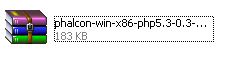
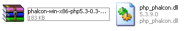
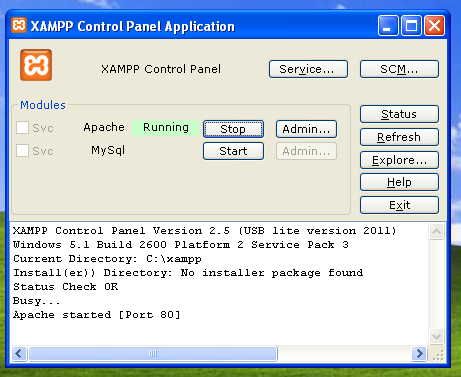
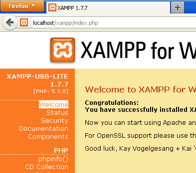

在XAMPP环境中安装Phalcon
=====================
XAMPP_ 是一个LAMP套件，使用它你能轻易地搭建Aapche、MySQL、PHP和Perl。下载XAMPP后，所有你要做的事情只是解压它，然后就开始使用。下面将详细介绍如何在Windows版本的XAMPP中安装Phalcon。推荐使用最新版本的XAMPP。

XAMPP_ is an easy to install Apache distribution containing MySQL, PHP and Perl. Once you download XAMPP, all you have to do is extract it and start using it. Below are detailed instructions on how to install Phalcon on XAMPP for Windows. Using the latest XAMPP version is highly recommended. 

下载正确Phalcon版本
-------------------------------------
XAMPP总是内置32位的Apache和PHP。所以你也只能下载x86版的Phalcon。

XAMPP is always releasing 32 bit versions of Apache and PHP. You will need to download the x86 version of Phalcon for Windows from the download section. 

下载Phalcon库，你将会得到一个zip文件，如下所示：

After downloading the Phalcon library you will have a zip file like the one shown below: 

解压该文件，获取Phalcon DLL文件：
    
Extract the library from the archive to get the Phalcon DLL: 

拷贝php_phalcon.dll到PHP扩展目录下。如果你的XAMPP安装在C:\\xampp目录下，PHP扩展的目录一般是C:\\xampp\\php\ext。
    
Copy the file php_phalcon.dll to the PHP extensions. If you have installed XAMPP in the c:\\xampp folder, the extension needs to be in c:\\xampp\\php\\ext

.. figure:: ../_static/img/xampp-3.png
    :align: center

编辑PHP配置文件php.ini，它位于C:\\xamp\\php\\php.ini。你可以使用记事本或类似软件编辑它。我们推荐你使用Notepad++，以避免换行可能带来的问题。在文件结尾加上这一句：extension=php_phalcon.dll，然后保存。
    
Edit the php.ini file, it is located at C:\\xampp\\php\\php.ini. It can be edited with Notepad or a similar program. We recommend Notepad++ to avoid issues with line endings. Append at the end of the file: extension=php_phalcon.dll and save it. 

.. figure:: ../_static/img/xampp-4.png
    :align: center  

能过XAMPP控制面板重启Apache服务。这会加载新的PHP配置文件。
    
Restart the Apache Web Server from the XAMPP Control Center. This will load the new PHP configuration. 

打开浏览器浏览 http://localhost 。你将会看到XAMPP的欢迎页面。点击 phpinfo() 链接。
    
Open your browser to navigate to http://localhost. The XAMPP welcome page will appear. Click on the link phpinfo().

phpinfo() 将会在屏幕上输出一大串PHP的环境信息。向下滚动屏幕，并确认phalcon扩展已经加载成功。
    
phpinfo() will output a significant amount of information on screen about the current state of PHP. Scroll down to check if the phalcon extension has been loaded correctly. 

.. figure:: ../_static/img/xampp-7.png
    :align: center

如果你能在phpinfo()的输出中看到phalcon版本，恭喜你！你已经可以使用Phalcon了。
    
If you can see the phalcon version in the phpinfo() output, congrats!, You are now flying with Phalcon. 

视频向导
----------
下面是Windows平台下安装Phalcon的视频向导：

The following screencast is a step by step guide to install Phalcon on Windows:     

.. raw:: html

   
<iframe src="http://player.vimeo.com/video/40265988" width="500" height="266" frameborder="0" webkitAllowFullScreen mozallowfullscreen allowFullScreen></iframe>

相关教程
--------------
* :doc:`Phalcon通用安装过程 </reference/install>`
* :doc:`在Windows平台的WAMP中安装Phalcon </reference/wamp>`

.. _XAMPP: http://www.apachefriends.org/en/xampp-windows.html
